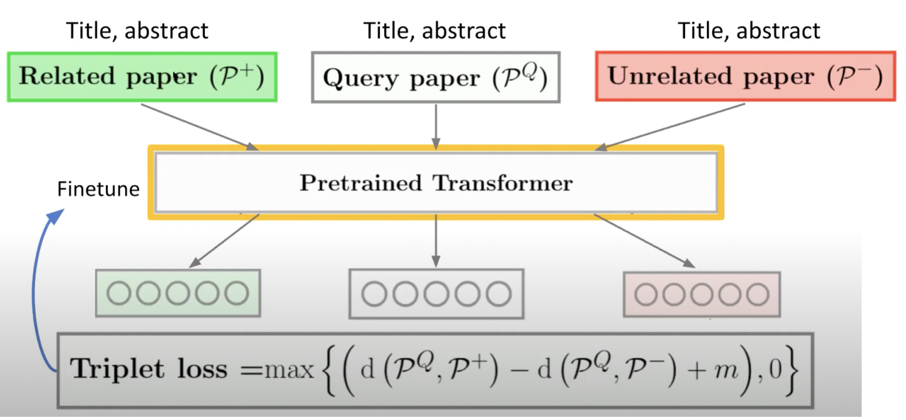

# Game Of Papers - A reccomendation system for research papers.

## Training the model



### Installation
    pip install -r requirement.txt

### Usage

**Train**
```
python train_single.py --epochs 50 --batch_size 128 --clip 1.0 --lr 1e-3 --embed_dim 300 \
 --freeze False --space_joiner True --dropout 0.2 \
 --loss_fn triplet --max_len 30 \
 --PRE_TRAINED_MODEL_NAME 'bert-base-uncased' \
 --model_path './ckpt/best_model_v6_triplet' \
 --train_dir './data/14k_data.csv' \
 --use_aux True --use_aug_data True
```

**TrainScibert**
```
python3 train_single.py --epochs 50 --batch_size 128 --clip 1.0 --lr 1e-3 --embed_dim 300 \
 --freeze False --space_joiner True --dropout 0.2 \
 --loss_fn triplet --max_len 30 \
 --PRE_TRAINED_MODEL_NAME 'allenai/scibert_scivocab_uncased' \
 --model_path './ckpt/scibert_model_v6_triplet_2' \
 --train_dir './data/paper_triplet_data.csv' \
 --use_aux True --use_aug_data True
```

**TestDB**
```
python evaluate_single.py --embed_dim 300 \
 --freeze False --space_joiner True --dropout 0.2 \
 --loss_fn triplet --max_len 30 \
 --PRE_TRAINED_MODEL_NAME 'emilyalsentzer/Bio_ClinicalBERT' \
 --model_path './ckpt/best_model_v6_triplet' \
 --train_dir './data/100k_data.csv'
```


**Inference**
```
python inference.py --embed_dim 300 \
 --PRE_TRAINED_MODEL_NAME 'emilyalsentzer/Bio_ClinicalBERT' \
 --model_path './ckpt/best_model_v6_triplet' \
```


## Testing the model against baselines
Easy way to test is to run ```python3 baseline_model_experiments/calculate_metrics.py```
This already runs a bunch of baseline models for you and gives you the result.

### Compare our model against any pretrained model on huggingface
Markup : 1. Run any baseline model by navigating to baseline_model_experiments/test_any_huggingface_model/huggingface_pretrained.py
            1.1 Add the name of the model you want to test in AutoModel function
        2. Run the file, it will create a sample.json, with embeddings and sorted reccomendations for papers.
        3. Read the sample.json, append it to the baseline_results list in calculate_metrics.py file and run it.

